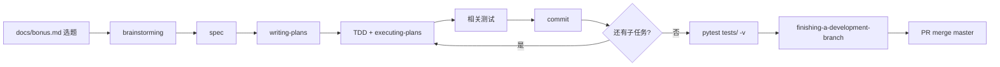

# FixLoop Bonus + Superpowers 工作流

FixLoop 项目 **Bonus / 功能扩展** 的标准 Agent 工作流。与 vendored [Superpowers](https://github.com/obra/superpowers) 组合使用；FixLoop 硬约束以 `CLAUDE.md` 为准。

**配套文件**

| 文件 | 用途 |
|------|------|
| [SKILL.md](fixloop-bonus-superpowers/SKILL.md) | Cursor 自动发现入口（frontmatter） |
| [reference.md](fixloop-bonus-superpowers/reference.md) | 模块映射、验收矩阵、已落地清单 |
| `docs/bonus.md` | 待办 backlog（P/C/I） |
| `docs/bonus/DESIGN.md` | 设计边界与 Gap |

---

## 0. 自动启用

`.cursor/rules/superpowers-workflow.mdc`（`alwaysApply: true`）在以下情况 **必须先 Read 本文件 + reference.md**：

- bonus、P1/P2、Layer1/Layer2 扩展
- 引用 `docs/bonus.md` 或 `docs/superpowers/specs|plans/`
- 在 `agent_runtime/`、`src/` 做新功能（非纯问答）

**每条消息第一动作**：判断 skill → Read → 开头声明 `Using <skill-name> to <purpose>`。

---

## 1. FixLoop 硬约束（高于 Superpowers 默认习惯）

| # | 规则 | 来源 |
|---|------|------|
| 1 | **动手前说明并获确认**：做什么 + 怎么实现（模块/决策/预估行数） | `CLAUDE.md` |
| 2 | **单任务只跑相关测试**；**提 PR 前** `pytest tests/ -v` | `CLAUDE.md` |
| 3 | 独立分支 → PR → squash merge；**禁止直接 push master** | `CLAUDE.md` |
| 4 | **最小 diff**：只改条目所需范围；重构单独 commit/PR | 项目约定 |
| 5 | **L1 不依赖 L2**：`agent_runtime/` 不得 `import src.*` | 分层架构 |
| 6 | gh 需代理（Windows）：`$env:HTTPS_PROXY="http://127.0.0.1:7897"` | `CLAUDE.md` |

---

## 2. 端到端流程

```text
选题 → 读 DESIGN 章 → brainstorming → spec → writing-plans → TDD 实现
     → 相关 pytest → commit（按任务）→ PR 前全量 pytest → gh PR → squash merge
```



### 阶段 → Skill 映射

| 阶段 | Skill | FixLoop 产出 |
|------|-------|--------------|
| 选题 | **本工作流** + reference | 确认 Layer、P 级、验收方式 |
| 设计 | `brainstorming` | `docs/superpowers/specs/YYYY-MM-DD-<slug>-design.md` |
| 计划 | `writing-plans` | `docs/superpowers/plans/YYYY-MM-DD-<slug>.md` |
| 实现 | `test-driven-development` + `executing-plans` 或 `subagent-driven-development` | 代码 + 测试 |
| 调试 | `systematic-debugging` | 根因 + 最小修复 |
| 验证 | `verification-before-completion` | 相关测试 / PR 前全量 |
| 收尾 | `finishing-a-development-branch` | PR、合并、清理分支 |

**Announce**：每阶段开头 `Using <skill> to <purpose>`。

---

## 3. 选题检查清单

开始任一 bonus 条目前，在对话中确认：

- [ ] `docs/bonus.md` 条目 **P/C/I**；背景见 `docs/bonus/DESIGN.md` 对应章
- [ ] **Layer**：L1 (`agent_runtime/`) | L2 (`src/`) | both
- [ ] **增强 vs 从零**：条目或 reference 是否已有 ✅ 基础
- [ ] **验收**：`pytest tests/test_*.py` / `eval case_XXX` / `demo/calculator` repair
- [ ] **规模**：小 &lt;100 行 · 中 100–400 · 大 &gt;400（大项拆 plan / 多 commit）
- [ ] **分支名**已确定（见 §5）

---

## 4. Spec / Plan 模板

### Spec 必含（FixLoop Context）

```markdown
# <标题> — 设计规格

## FixLoop Context
- **Bonus ref:** docs/bonus.md §N — [条目标题]
- **Layer:** L1 | L2 | both
- **Primary modules:** ...
- **Acceptance:** pytest ... / eval ... / demo ...
- **Branch:** V1.x-BonusN-<slug> 或 M{m}/D{d}/<slug>

## 方案 A（推荐）
...

## 不在范围
...
```

### Plan 必含

在 Superpowers plan header 之外增加同上 **FixLoop Context**；每个任务写清：

- 精确文件路径（`agent_runtime/` vs `src/repair/`）
- 先写 failing test 还是后补
- 预计行数
- 相关测试命令（非全量）

---

## 5. Git / 分支 / PR

### 分支命名

```text
V{major}.{minor}-Bonus{n}-{slug}   # Bonus 专项，如 V1.2-Bonus6-Multi-Agent
M{m}/D{d}/{task-slug}              # 里程碑日常任务
bonus/<short-slug>                 # 小项可选
```

### 工作流

```powershell
git checkout master && git pull
git checkout -b V1.2-Bonus7-<slug>
# 开发 + 相关 pytest
git add ... && git commit -m "feat(V1.2-Bonus7): <描述>"
git push -u origin HEAD

$env:HTTPS_PROXY="http://127.0.0.1:7897"; $env:HTTP_PROXY="http://127.0.0.1:7897"
gh pr create --base master --title "V1.2-Bonus7-<slug>" --body "..."
pytest tests/ -v   # PR 前全量
gh pr merge --squash --delete-branch
git checkout master && git pull
```

### PR 规范

- **Title = 分支名**（完全一致）
- **Body 中文**：`## 摘要` · `## 测试计划` · 可选 `## 提交`
- 多 commit 分支：squash merge；每 commit 聚焦一个子任务
- **禁止**直接 `git push origin master`

---

## 6. 测试策略

| 时机 | 命令 | 说明 |
|------|------|------|
| 实现单任务 | `pytest tests/test_<相关>.py -v` | **禁止**全量 |
| commit 前 | 同上 | 相关通过即可 |
| 提 PR 前 | `pytest tests/ -v` | 必须全量 |
| PR 合并 | 全量通过 + lint 零 warning | |

### 常见改动 → 相关测试

| 改动 | 优先测试 |
|------|----------|
| `agent_runtime/*` | `tests/test_agent_loop.py`, `test_context_manager.py`, … |
| `src/repair/*` | `tests/test_orchestrator.py`, `test_repair_*.py`, `test_blackboard_*.py` |
| `src/repair/degrade.py` | `tests/test_repair_degrade.py` |
| L2 binding | `tests/test_l2_binding.py`, `test_l2_state_binding.py` |
| phase timeout | `tests/test_phase_clock.py`, `test_phase_timeout.py` |

---

## 7. Layer 边界与模块速查

### 分层

- **L1** `agent_runtime/`：单 Agent 生命周期、Loop、Context、Tools、Provider
- **L2** `src/`：Orchestrator、repair pipeline、eval、skills
- L2 通过 factory 创建多个 L1 Agent；**L1 禁止 import L2**

### 能力域 → 先读

| 域 | 路径 |
|----|------|
| Agent Loop | `agent_runtime/agent_loop.py`, `LAYER1_GUIDE.md` |
| Context / Token | `agent_runtime/context_manager.py`, `tokenizers.py` |
| Multi-Agent 修复 | `src/orchestrator.py`, `src/repair/`, `LAYER2_GUIDE.md` |
| Blackboard | `src/repair/blackboard_merge.py`, `blackboard_subscribe.py`, `blackboard_mixin.py` |
| L2 绑定 | `src/state.py` (`AgentAskRef`), `src/repair/l2_binding.py`, `l2_ask_mixin.py` |
| 降级 | `src/repair/degrade.py` |
| 可观测 | `src/repair/run_trace.py`, `.agent/runs/*/trace.jsonl` |
| 评测 | `src/eval/`, `tests/test_orchestrator.py` |

---

## 8. Bonus 专项模式（Multi-Agent / L2）

L2 增强常用模式（V1.2-Bonus6 已验证）：

1. **Write-only → merge at boundary**：Localize 写 Blackboard；Patcher 前 `merge_blackboard_for_patch`
2. **Prefix 订阅**：`render_patcher_prefix_blocks` 注入 prompt
3. **L2 agent_asks**：`_begin_l2_agent_ask` / `_finish_l2_agent_ask`；L1 trace 经 `agent_runtime/l2_context.py`
4. **RepairRunContext**：repair 期间 ephemeral 状态（blackboard、tracer、cancel）
5. **Degrade 加固**：verify 耗尽 → baseline；`--no-degrade`；`degraded_baseline` metadata tag

新增 L2 功能时优先 **Mixin 拆分**（`l2_ask_mixin` / `blackboard_mixin`），避免 `pipeline.py` 膨胀。

---

## 9. 用户意图 → Skill 路由

| 用户说 | 第一个 skill |
|--------|--------------|
| 「做 bonus §X / P1 Y」 | 本工作流 → `brainstorming` |
| 「按推荐方案实现」 | `test-driven-development` + `executing-plans`（已 approved spec 时） |
| 「规划 / 拆任务」 | `writing-plans` |
| 「修测试失败 / repair 失败」 | `systematic-debugging` |
| 「commit / 推 PR / 合并」 | `finishing-a-development-branch` |
| 「检查是否需要重构」 | 本工作流 + 代码审查（不自动大 refactor） |
| 「并行探方案」 | `dispatching-parallel-agents` |

---

## 10. 反模式（避免）

- ❌ 未确认直接改代码（跳过 brainstorming / 用户确认）
- ❌ 单任务跑 `pytest tests/ -v`（浪费时间）
- ❌ 提 PR 不跑全量测试
- ❌ L1 `import src.repair.*`
- ❌ 顺手大范围重构混入 feature commit
- ❌ 直接 push master 或本地 merge 代替 PR
- ❌ 重复实现 reference 已列 ✅ 项（如统一 trace、CancellationToken、Bonus6 Blackboard 主路径）

---

## 11. 单任务执行清单（Agent 自检）

```text
[ ] Read 本文件 + reference + bonus 条目 + DESIGN 章
[ ] 向用户说明方案，获确认
[ ] Using brainstorming / writing-plans（如需）
[ ] 写 spec/plan 到 docs/superpowers/
[ ] TDD：先 failing test（如适用）
[ ] 实现最小 diff
[ ] 跑相关 pytest，贴输出摘要
[ ] 用户要求时再 commit
[ ] 全分支完成后：pytest tests/ -v → PR → merge
```

---

## 12. 维护

```powershell
# 更新 vendored Superpowers
powershell -File scripts/update-superpowers-skills.ps1
```

- Superpowers 上游：https://github.com/obra/superpowers
- 安装说明：`docs/superpowers/README.md`
