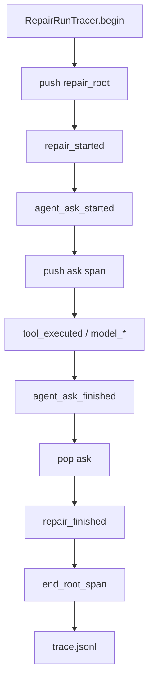

# Canonical Trace（实现链路）

> 抽象说明 FixLoop 如何用统一事件信封与 Span 栈记录 Issue→Verifier 运行过程，并可用 `trace_id`/`run_id` 还原顺序与阶段树。  
> **权威决策**：`docs/design-decisions.md` ADR-011（兼容 ADR-009 JSONL）。  
> **代码**：`agent_runtime/canonical_trace.py`、`agent_runtime/run_store.py`、`src/repair/run_trace.py`。  
> Langfuse / Prometheus 适配见 `docs/LANGFUSE_PROMETHEUS.md`（周计划功能2）。

---

## 1. 问题与边界

### 1.1 要解决什么

1. 多 Agent 共享同一 `trace.jsonl` 时，顶层字段不统一，难做跨阶段检索  
2. 需要按 `run_id` / `trace_id` 稳定还原时间线（含同毫秒事件的 `seq`）  
3. 需要父子 Span，表达 repair root → agent ask → tool/model 嵌套  
4. 为后续 Langfuse 等导出提供稳定本地契约  

### 1.2 明确不做

- 不改 ADR-009 的 JSONL 追加落库模型  
- 不强制重命名既有 `event` 字符串（只增加 `event_type` 别名）  
- Canonical 切片本身不含 exporter 实现；导出见 `agent_runtime/observability/` 
- 不保证「每一次 Memory 字段写入」都有独立 Trace 事件（见 §7）  

### 1.3 在系统中的位置

```text
Orchestrator._begin_repair_trace
        │
        ▼
┌───────────────────────────────┐
│ RepairRunTracer.begin         │  push repair_root → repair_started
└───────────────┬───────────────┘
                │  shared_run_id 绑定各 Agent
                ▼
┌───────────────────────────────┐
│ L2AskMixin                    │  ask_started push / ask_finished pop
│ AgentLoop._emit               │  tool / model / memory_dream / …
└───────────────┬───────────────┘
                │
                ▼
┌───────────────────────────────┐
│ RunStore.append_trace_event   │  Canonical 信封 enrich（失败降级旧格式）
└───────────────┬───────────────┘
                │
                ▼
        .agent/runs/<run_id>/trace.jsonl
```

一句话口诀：`emit → 信封 enrich → JSONL 追加`；用 **`trace_id == run_id`（v1）** 串联各阶段。

---

## 2. 能力全景

| 能力 | 说明 |
|------|------|
| 统一信封 | `schema_version=1`：`run_id/trace_id/span_id/parent_span_id/event_type/timestamp/status/seq` |
| 兼容旧字段 | 保留 `event`、`created_at`；与新字段同值 |
| Span 栈 | `TraceSpanContext`（ContextVar）：root + ask 子 span |
| 异常闭合 | 悬挂 ask span → `span_closed`（`reason=abnormal`） |
| 校验 / 排序 | `validate_event`、`order_events`、`load_ordered_trace(run_id)` |
| 脱敏 | payload 经 `redact_artifact`；信封禁止写密钥 |
| 示例 | `docs/examples/canonical-trace-sample.jsonl` |

---

## 3. 端到端链路（抽象）

```text
repair begin
   reset_seq + push(repair_root)
   emit repair_started (status=ok)
        │
        ├─ agent_ask_started → push(ask:role:phase)
        │       ├─ tool_executed / model_* / …
        │       │     （继承当前 ask span）
        │       └─ agent_ask_finished → emit 后 pop
        │
        ├─ （若 ask 未 pop）close_dangling → span_closed abnormal
        │
        ├─ repair_finished | repair_cancelled
        └─ end_root_span → span_closed normal + reset
```



---

## 4. 模块与文件

| 路径 | 职责 |
|------|------|
| `agent_runtime/canonical_trace.py` | 信封 enrich、Span、校验、排序、事件目录常量 |
| `agent_runtime/run_store.py` | `append_trace_event` 写入点；`load_trace_events` / `load_ordered_trace` |
| `src/repair/run_trace.py` | `RepairRunTracer`：begin / emit / dangling close / finalize |
| `src/repair/l2_ask_mixin.py` | ask 生命周期 push/pop + status |
| `src/orchestrator.py` | cancel 路径：`close_dangling` + `repair_cancelled` + `end_root_span` |
| `agent_runtime/agent_loop.py` | L1 `_emit`（共享 `shared_run_id` 时写入同一 Trace） |
| `docs/design-decisions.md` ADR-011 | 决策记录 |
| `tests/test_canonical_trace.py` | 信封 / Span / 异常闭合 / 样例校验 |

---

## 5. 信封字段（schema_version=1）

| 字段 | 说明 |
|------|------|
| `schema_version` | `"1"` |
| `run_id` / `trace_id` | **v1 二者相同**（一次 repair 一条 Trace） |
| `span_id` / `parent_span_id` | 当前 Span；root 的 parent 为 `null` |
| `event` / `event_type` | 兼容旧键；二者同值 |
| `created_at` / `timestamp` | ISO-UTC；二者同值 |
| `status` | `ok` \| `error` \| `cancelled` \| `unset` |
| `seq` | 每 `run_id` 单调递增，同毫秒可排序 |
| `payload` | 可选；经脱敏 |

**status 推断（摘要）**

| 事件 | 典型 status |
|------|-------------|
| `repair_started` / `agent_ask_started` | `ok` |
| `repair_finished` / `agent_ask_finished` | 由 payload `status`/`stop_reason` → ok/error/cancelled |
| `repair_cancelled` / `run_cancelled` | `cancelled` |
| `span_closed` + `reason=abnormal` | `error` |
| 多数中间事件（如 `tool_executed`） | `unset`（可显式传入覆盖） |

---

## 6. 事件目录（既有名，不强制改名）

| 类别 | 代表事件 |
|------|----------|
| 模型 | `model_request_start`、`model_first_token`、`model_complete` |
| 工具 | `tool_executed`、`tool_preview`、`tool_order_warning` |
| Skill | `skill_matched`、`skill_hint_rendered`、`skill_routed`（可执行 Router） |
| Context | `context_built`、`compression_triggered` |
| 状态 | `repair_*`、`agent_ask_*`、`run_*`、`span_closed` |
| Artifact / 验证 | `baseline_verify_finished`、`blackboard_snapshot` |
| Memory | `memory_dream`（Dream 周期）；**非**逐字段 write |

完整常量见 `EVENT_CATALOG`（`canonical_trace.py`）。

---

## 7. 用 `trace_id` 串联什么

前提：repair 路径已绑定 `shared_run_id`（即 `trace_id`）。

| 信号 | 能否进同一 Trace | 说明 |
|------|------------------|------|
| 工具调用 | 可以 | `tool_executed` |
| 停止 / 结束 | 可以 | `run_finished`（含 `stop_reason`）、`run_cancelled`、`agent_ask_finished`、`repair_finished` |
| Memory Dream | 可以 | `memory_dream` |
| Memory 逐次写入 | 目前不行 | `update_memory_after_tool` 改 session，无独立 `memory_write` 事件；摘要多在 `report.json` |
| stderr 结构化日志 | 间接可以 | `log_context` 注入 `run_id`（= `trace_id`）；字段名尚未单独写 `trace_id` |

检索示例：

```python
from agent_runtime.run_store import RunStore

store = RunStore(repo_root)
ordered = store.load_ordered_trace(run_id)  # == trace_id in v1
tools = [e for e in ordered if e.get("event") == "tool_executed"]
stops = [e for e in ordered if e.get("event") in ("run_finished", "repair_finished", "agent_ask_finished")]
```

---

## 8. Span 规则

1. `repair_started` 前：`reset_seq(run_id)` + `TraceSpanContext.reset()` + `push("repair_root")`  
2. `agent_ask_started` → `push("ask:<agent>:<phase>")`  
3. `agent_ask_finished` → **先 emit（仍属 ask span）再 pop**  
4. `finalize` / `cancel`：先 `close_dangling_ask_spans()`（写 `span_closed` abnormal），再写结束事件，最后 `end_root_span()`  
5. 结束必须 `reset()`，防止 ContextVar 泄漏到下一任务  

---

## 9. 读取、校验与样例

```python
from agent_runtime.run_store import RunStore
from agent_runtime.canonical_trace import validate_event

store = RunStore(repo_root)
for ev in store.load_ordered_trace(run_id):
    assert not validate_event(ev)
```

- 样例：[`docs/examples/canonical-trace-sample.jsonl`](examples/canonical-trace-sample.jsonl)（Issue→localize→patch→verify→finish）  
- 测试：`tests/test_canonical_trace.py`（信封、父子 Span、异常闭合、样例 seq 递增）

落盘路径：`.agent/runs/<run_id>/trace.jsonl`（超阈值可 gzip，见既有 TTL/gzip 策略）。

---

## 10. 设计原则（可对外口述）

1. **JSONL 追加不变**——崩溃不丢已写事件；Replay 仍按行序  
2. **信封增量兼容**——旧三字段保留；新字段可忽略读  
3. **`trace_id == run_id`（v1）**——一条修复任务一条 Trace，检索成本最低  
4. **唯一增强写入点**——`append_trace_event`；enrich 失败降级，不阻塞主任务  
5. **Span 表达阶段、event 表达动作**——树看结构，时间线看行为  

---

## 11. 演进方向

1. ~~Langfuse / Prometheus 适配（功能2）~~ → `docs/LANGFUSE_PROMETHEUS.md`  
2. `log_context` 显式输出 `trace_id` 字段（与 `run_id` 同值）  
3. 可选 `memory_written` 事件（若需要逐次 Memory 审计）  
4. 若未来要跨进程/跨任务关联，再拆分 `trace_id ≠ run_id`  

---

## 12. 一句话总结

`agent_runtime/canonical_trace`（+ `RunStore`），统一 Trace 信封与 Span 栈 + `trace_id`/`run_id` 串联工具/停止/阶段事件 + 校验排序与样例评测。
